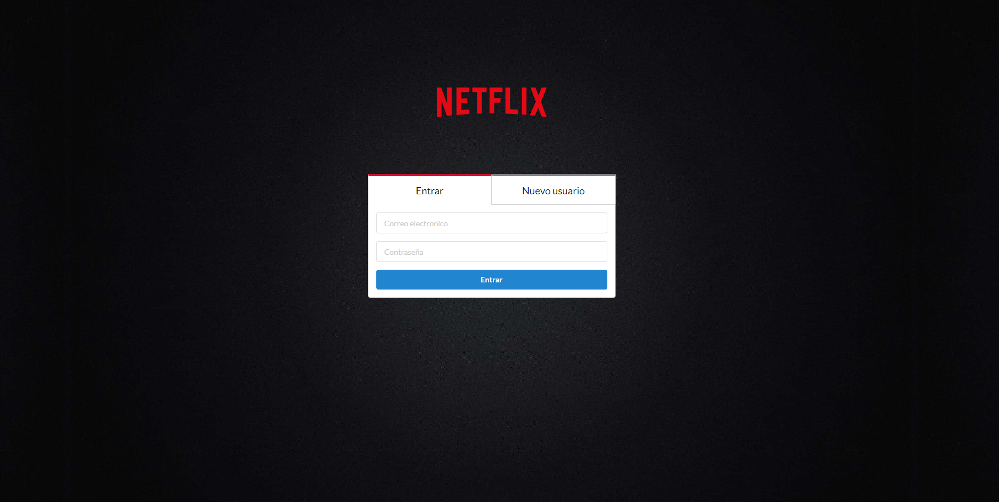
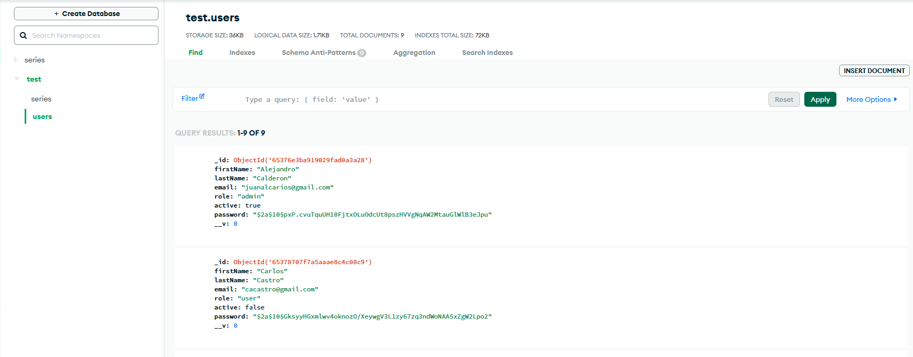
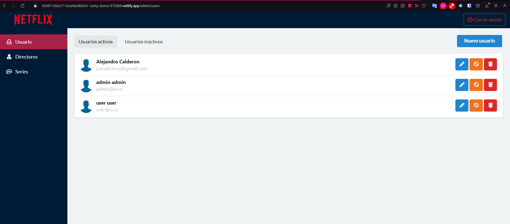

# CLIENTE para Registro de Series de Televisión

Este proyecto es una aplicación cliente-servidor desarrollada con Express para el servidor y React.js para el cliente. El servidor se encarga de gestionar la lógica de la aplicación y utiliza una base de datos MongoDBAtlas para almacenar datos. 

El cliente, desarrollado en React.js, proporciona una interfaz de usuario atractiva y receptiva.

La aplicación se encuentra desplegada en la siguiente URL del cliente: [Cliente en Netlify](https://653897d897430140fe0fb56c--zesty-donut-873db9.netlify.app/admin). Esta misma se encuentra conectada al servidor y la base de datos previamente mencionadas.

Para iniciar sesión y explorar la aplicación, puedes utilizar las siguientes credenciales de prueba y asi validar los permisos de cada una:

- Usuario Administrador:
  - Correo Electrónico: admin@a.co
  - Contraseña: admin

- Usuario Regular:
  - Correo Electrónico: user@u.co
  - Contraseña: user

La aplicación te permitirá realizar una validación de la interfaz con permisos de administrador y usuario. A continuación, se describen algunas de las funcionalidades:

- **Creación de Usuarios:** Puedes crear nuevos usuarios utilizando la opción correspondiente en la interfaz. La aplicación valida y almacena los datos del usuario en la base de datos.

- **Creación de Series:** Puedes agregar nuevas series proporcionando detalles como nombre, fecha de lanzamiento, directores, temporadas y cantidad de episodios. La aplicación almacena esta información en la base de datos.

- **Botones de Modificación:** Aunque los botones de modificación están presentes en la interfaz, aún no están conectados al servidor. Estos botones permitirán realizar acciones como modificar detalles de series, activar o desactivar series y eliminar series.

Todas estas funcionalidades están implementadas en la interfaz, pero algunos de los botones de acción aún no se conectan al servidor. Están diseñados para demostrar las acciones que se pueden realizar en la aplicación.

## Empezando con Create React App

Este proyecto fue inicializado con [Create React App](https://github.com/facebook/create-react-app).

## Scripts Disponibles

En el directorio del proyecto, puedes ejecutar:

### `yarn start`

Ejecuta la aplicación en el modo de desarrollo.\
Abre [http://localhost:3000](http://localhost:3000) para verla en tu navegador.

La página se recargará automáticamente cuando realices cambios.\
También podrás ver cualquier error de lint en la consola.

### `yarn test`

Lanza el corredor de pruebas en modo interactivo.\
Consulta la sección sobre [cómo ejecutar pruebas](https://facebook.github.io/create-react-app/docs/running-tests) para obtener más información.

### `yarn build`

Compila la aplicación para producción en la carpeta `build`.\
Agrupa React correctamente en modo de producción y optimiza la compilación para obtener el mejor rendimiento.

El código se minimiza y los nombres de archivo incluyen los hashes.\
¡Tu aplicación está lista para ser desplegada!

Consulta la sección sobre [despliegue](https://facebook.github.io/create-react-app/docs/deployment) para obtener más información.

### `yarn eject`

**Nota: esta es una operación de una sola dirección. Una vez que haces `eject`, no puedes volver atrás.**

Si no estás satisfecho con la herramienta de compilación y las opciones de configuración, puedes hacer `eject` en cualquier momento. Este comando eliminará la dependencia de compilación única de tu proyecto.

En cambio, copiará todos los archivos de configuración y las dependencias transitivas (webpack, Babel, ESLint, etc.) directamente en tu proyecto para que tengas un control total sobre ellos. Todos los comandos excepto `eject` seguirán funcionando, pero apuntarán a los scripts copiados para que puedas ajustarlos. En este punto, estarás por tu cuenta.

No es necesario usar `eject`. El conjunto de características preseleccionadas es adecuado para despliegues pequeños y medianos, y no debes sentirte obligado a usar esta función. Sin embargo, entendemos que esta herramienta no sería útil si no pudieras personalizarla cuando estés listo.
